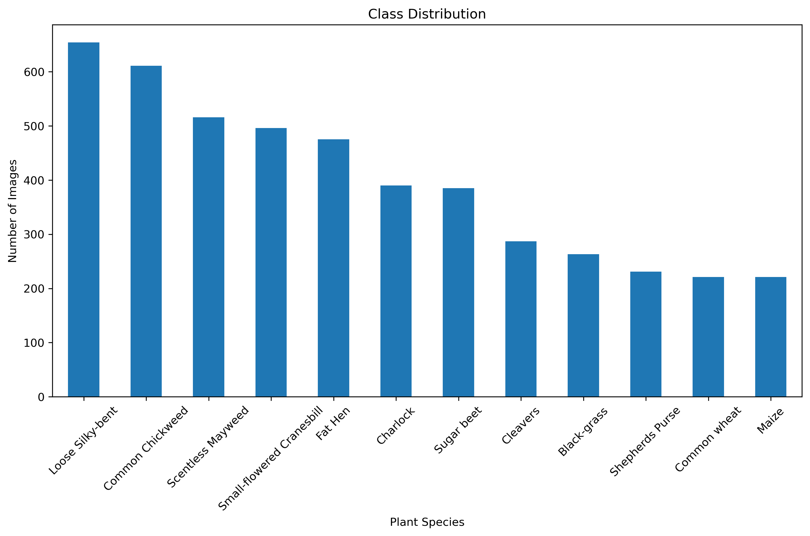
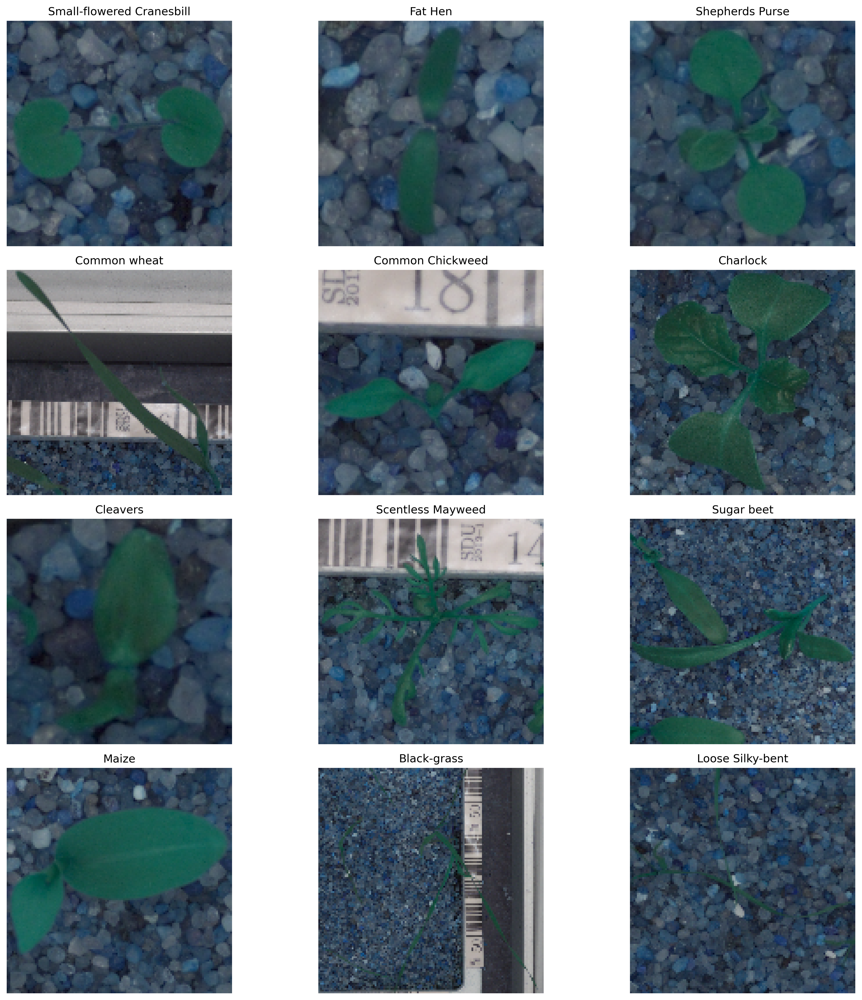
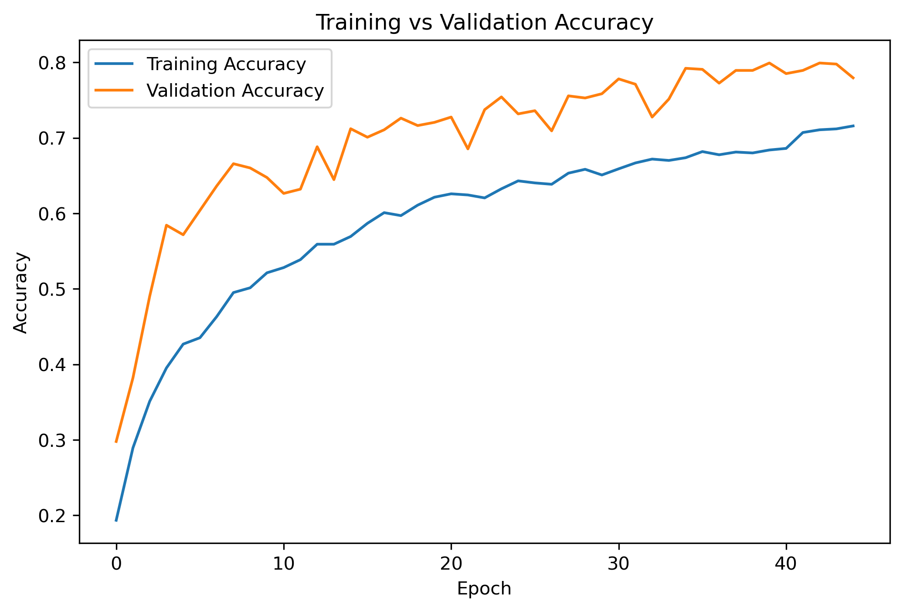
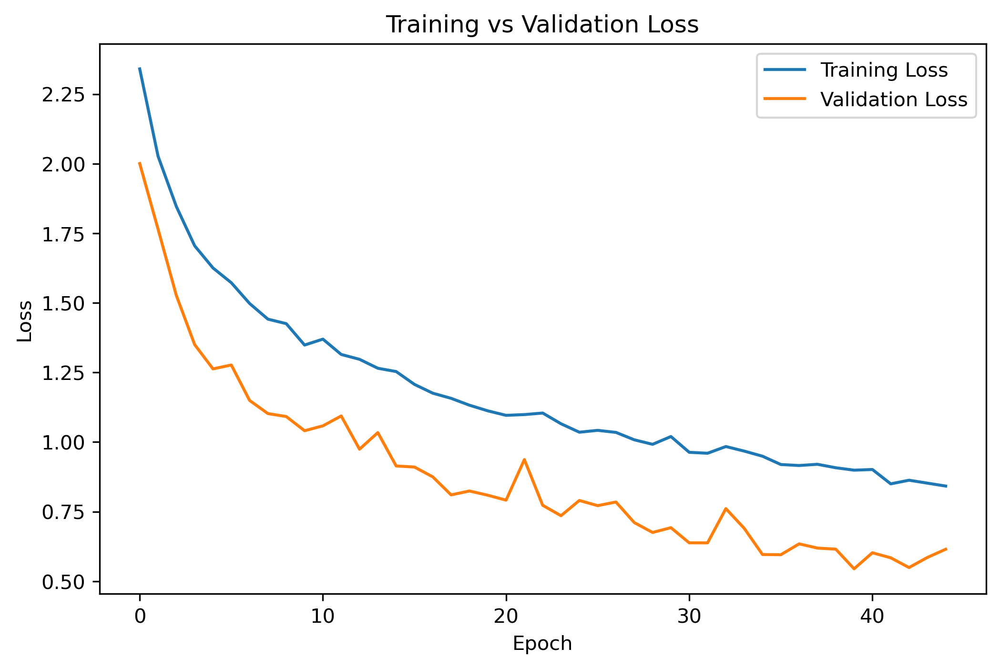
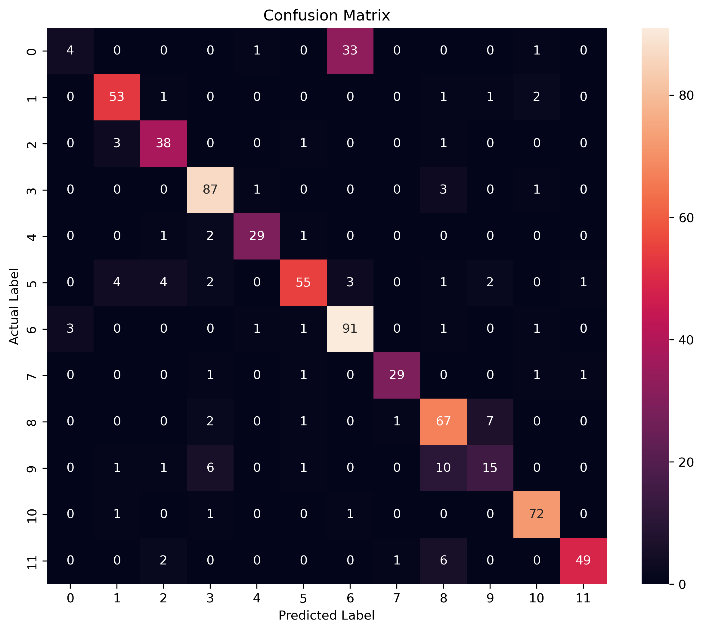

# Plant Seedling Classification — Convolutional Neural Network (CNN)

This project develops a **Convolutional Neural Network (CNN)** to classify RGB images of crop seedlings and weeds into 12 plant species categories using computer vision techniques. The model is designed to support agricultural decision-making by distinguishing crop seedlings from weeds during early growth stages — enabling targeted herbicide application, crop monitoring, and precision agriculture practices.

The analysis covers:

- **Exploratory Data Analysis:** Class distribution, sample image inspection, and pixel intensity statistics across 4,750 RGB images.
- **Preprocessing:** Image resizing (128×128), pixel normalization to [0,1], integer label encoding, stratified 70/15/15 train/validation/test split, and dynamic data augmentation during training.
- **Model Architecture:** A 11-layer CNN with 3 convolutional blocks (32→64→128 filters), max pooling, dropout regularization (0.5), and a softmax output layer for 12-class classification.
- **Training:** Adam optimizer, sparse categorical crossentropy loss, early stopping on validation loss (patience=5), and `restore_best_weights=True`.
- **Evaluation:** Test accuracy, weighted precision/recall/F1, and confusion matrix analysis across all 12 species.

> **Note on Dataset Availability**
> The image dataset has been removed from this repository as it is proprietary and cannot be shared publicly. All visualizations, the processed dataset (`processed_dataset.pkl`), and the trained model (`model.h5`) generated during the analysis are retained for reference and presentation purposes.

---

## Results

| Metric | Value |
|---|---|
| Test Accuracy | **82.61%** |
| Weighted Precision | 0.82 |
| Weighted Recall | 0.83 |
| Weighted F1 Score | 0.81 |
| Final Training Accuracy | 71.58% |
| Best Validation Accuracy | 79.92% |
| Training stopped at | Epoch 45 / 100 |

---

## Model Architecture

| Layer | Type | Output Shape | Filters / Neurons |
|---|---|---|---|
| 1 | Input | (128, 128, 3) | — |
| 2 | Conv2D + ReLU | (126, 126, 32) | 32 filters |
| 3 | MaxPooling2D | (63, 63, 32) | — |
| 4 | Conv2D + ReLU | (61, 61, 64) | 64 filters |
| 5 | MaxPooling2D | (30, 30, 64) | — |
| 6 | Conv2D + ReLU | (28, 28, 128) | 128 filters |
| 7 | MaxPooling2D | (14, 14, 128) | — |
| 8 | Flatten | (25088,) | — |
| 9 | Dense + ReLU | (128,) | 128 neurons |
| 10 | Dropout | (128,) | rate = 0.5 |
| 11 | Dense + Softmax | (12,) | 12 neurons |

**Total trainable parameters: 3,306,188**

---

## Visualizations

| Class Distribution | Sample Images per Species |
|---|---|
|  |  |

| Training & Validation Accuracy | Training & Validation Loss |
|---|---|
|  |  |

| Confusion Matrix |
|---|
|  |

---

## Reproducibility

The notebook checks for existing saved artifacts before retraining:
- If `model.h5` and training history exist → loaded and reused
- If `processed_dataset.pkl` exists → loaded without reprocessing
- Otherwise → full preprocessing and training runs automatically

A fixed random seed (`42`) is applied to NumPy, TensorFlow, and Python's `random` library before any splitting or training.

---

## How to Run

### Prerequisites

```bash
pip install -r requirements.txt
```

### Dataset Setup

Place the raw image dataset inside the `data/` folder:

```
project/
├── data/
│   └── images/                 ← plant seedling images organized by species folder
├── main.py
├── requirements.txt
└── README.md
```

### Run

```bash
python main.py
```

The script handles all preprocessing, model training, evaluation, and visualization automatically. Model artifacts are saved to the `saved_model/` folder. On subsequent runs, saved model and dataset artifacts are reloaded automatically to avoid unnecessary retraining.

---

## Project Structure

```
project/
├── data/
│   ├── images/                        # Raw image dataset (not included — see note above)
│   └── processed_dataset.pkl          # Generated by main.py — preprocessed arrays + metadata
├── saved_model/
│   ├── history.pkl                     # Trained CNN model
│   ├── plant_seedling_cnn.h5           # Training accuracy and loss per epoch
├── Figures/ 
│   ├── visualizations                 # All generated visualizations
├── main.py                            # Entry point — run this
├── requirements.txt
└── README.md
```

## Key Libraries

| Library | Purpose |
|---|---|
| `tensorflow` / `keras` | CNN architecture, training, evaluation |
| `numpy` | Array operations, random seed |
| `pandas` | Label handling and metadata |
| `matplotlib` / `seaborn` | Training curves, confusion matrix, EDA plots |
| `scikit-learn` | Train/val/test split, classification report, metrics |
| `pickle` | Saving and loading processed dataset and history |
